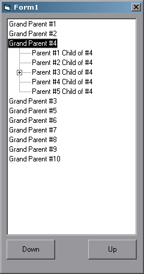



## Move Nodes

### Description

This program allows you to use command buttons to move a node up or down in a TreeView. It includes a recursive function to move all children with it. The whole stucture under the node is preserved. The moved node can also be at any level in the treeview.
 
### More Info
 

             |
---                |---
**Submitted On**   |2002-06-08 11:10:40
**By**             |[Kristopher](https://github.com/Planet-Source-Code/PSCIndex/blob/master/ByAuthor/kristopher.md)
**Level**          |Intermediate
**User Rating**    |5.0 (35 globes from 7 users)
**Compatibility**  |VB 5\.0, VB 6\.0
**Category**       |[Coding Standards](https://github.com/Planet-Source-Code/PSCIndex/blob/master/ByCategory/coding-standards__1-43.md)
**World**          |[Visual Basic](https://github.com/Planet-Source-Code/PSCIndex/blob/master/ByWorld/visual-basic.md)
**Archive File**   |[Move\_Nodes91830682002\.zip](https://github.com/Planet-Source-Code/kristopher-move-nodes__1-35615/archive/master.zip)

